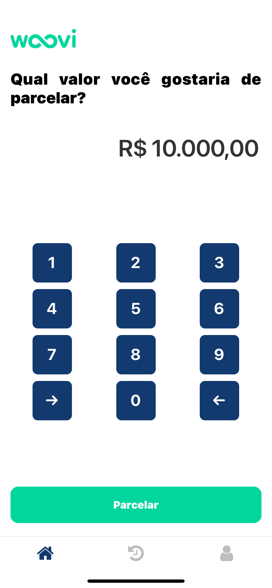
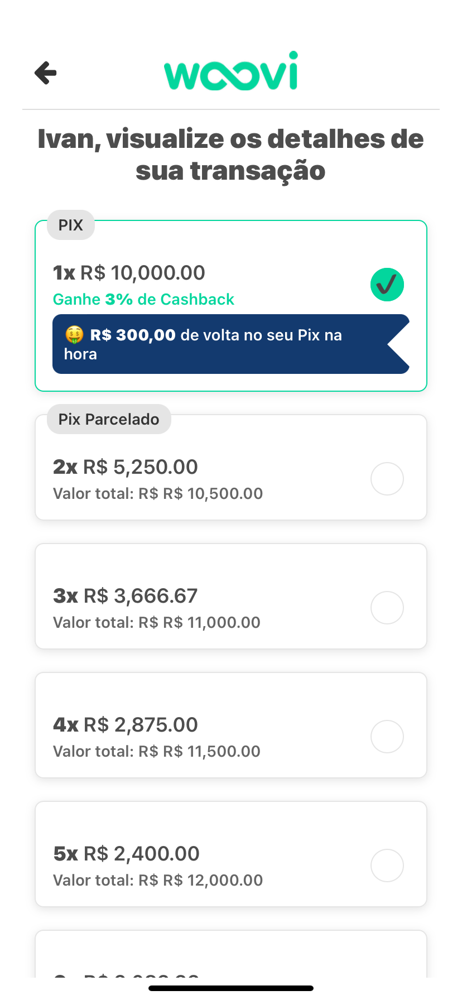

# App Woovi PIX Parcelado




> Aplicação mobile desenvolvida para fins de estudos, criado com base no desafio de [FrontEnd Junior da Woovi](https://woovi.com/jobs/challenges/frontend-engineer/).


## 💻 Pré-requisitos

Antes de começar, verifique se você atendeu aos seguintes requisitos:

- Você instalou a versão mais recente do [Node.js](https://nodejs.org/) (você pode verificar a versão instalada com `node -v`).
- Você tem o [Expo CLI](https://docs.expo.dev/get-started/installation/) instalado globalmente. Para instalar, execute `npm install -g expo-cli`.
- Você possui o [Git](https://git-scm.com/) instalado para controle de versão. Verifique com `git --version`.
- Você tem uma máquina com [Windows](https://www.microsoft.com/pt-br/windows/get-windows-10), [Linux](https://www.linux.org/), ou [Mac](https://www.apple.com/mac/) (macOS).
- Você tem o [Visual Studio Code](https://code.visualstudio.com/) ou outro editor de código de sua preferência instalado.
- Você tem o [Android Studio](https://developer.android.com/studio) ou [Xcode](https://developer.apple.com/xcode/) (para desenvolvimento iOS) instalado, se desejar testar seu aplicativo em um emulador/simulador.

Certifique-se também de que seu ambiente de desenvolvimento está configurado corretamente seguindo a [documentação oficial do Expo](https://docs.expo.dev/get-started/installation/).

## 🚀 Instalando o projeto

Para instalar o projeto, siga estas etapas:

### Linux e macOS:

1. **Clone o repositório do projeto:**

    ```bash
    git clone https://github.com/higorxi/woovi-challenge-app
    ```

2. **Navegue até o diretório do projeto:**

    ```bash
    cd woovi-challenge-app
    ```

3. **Instale as dependências do projeto:**

    ```bash
    npm install
    ```

    ou, se você preferir usar o Yarn:

    ```bash
    yarn install
    ```

4. **Inicie o projeto:**

    ```bash
    npm run start
    ```

### Windows:

1. **Clone o repositório do projeto:**

    ```bash
    git clone https://github.com/higorxi/woovi-challenge-app
    ```

2. **Navegue até o diretório do projeto:**

    ```bash
    cd woovi-challenge-app
    ```

3. **Instale as dependências do projeto:**

    ```bash
    npm install
    ```

    ou, se você preferir usar o Yarn:

    ```bash
    yarn install
    ```

4. **Inicie o projeto:**

    ```bash
    npm run start
    ```

Certifique-se de ter o [Expo CLI](https://docs.expo.dev/get-started/installation/) instalado para executar o comando `npm run start` corretamente.


## 📫 Contribuindo para o projeto do App PIX

Para contribuir, siga estas etapas:

1. Bifurque este repositório.
2. Crie um branch: `git checkout -b <nome_branch>`.
3. Faça suas alterações e confirme-as: `git commit -m '<mensagem_commit>'`
4. Envie para o branch original: `git push origin <nome_do_projeto> / <local>`
5. Crie a solicitação de pull.

Como alternativa, consulte a documentação do GitHub em [como criar uma solicitação pull](https://help.github.com/en/github/collaborating-with-issues-and-pull-requests/creating-a-pull-request).

## 🤝 Colaboradores

Agradecemos às seguintes pessoas que contribuíram para este projeto:

<table>
  <tr>
    <td align="center">
      <a href="#" title="defina o titulo do link">
        <br>
        <sub>
          <b>Higor Giovane</b>
        </sub>
      </a>
    </td>
  </tr>
</table>

## 📝 Licença

Esse projeto está sob licença. Veja o arquivo [LICENÇA](LICENSE.md) para mais detalhes.
